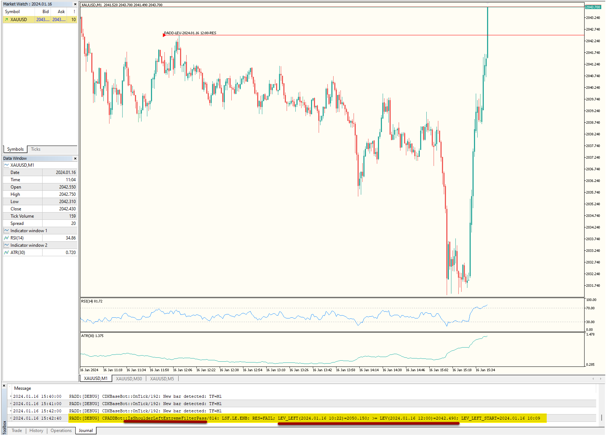
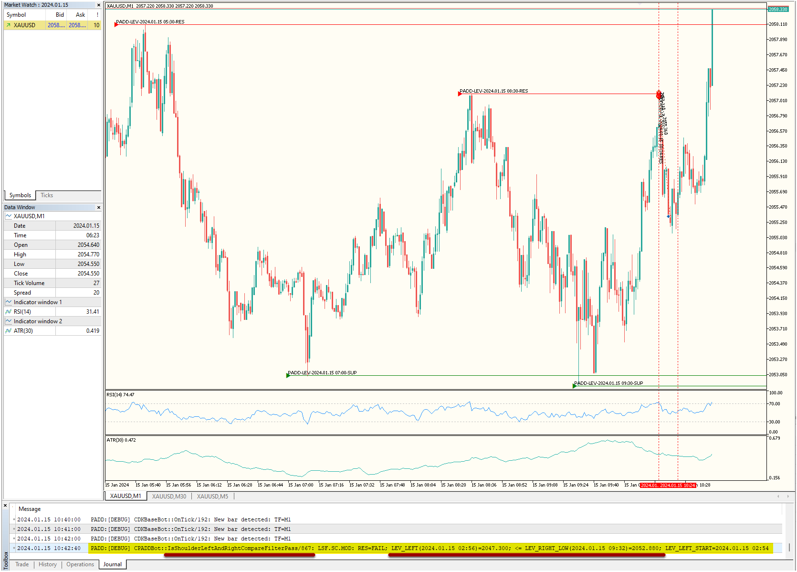
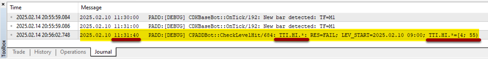
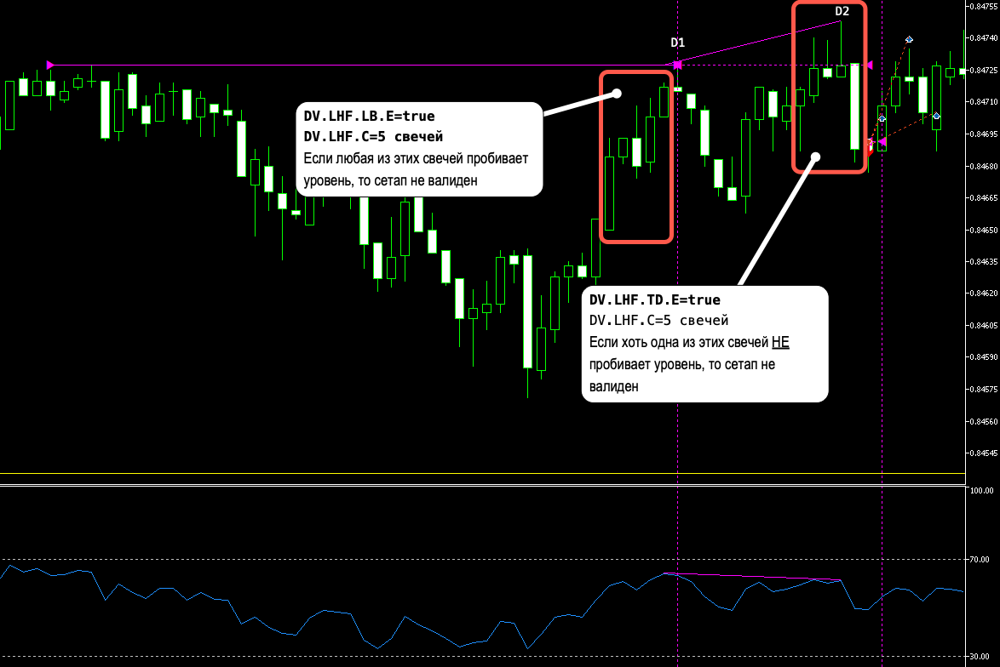
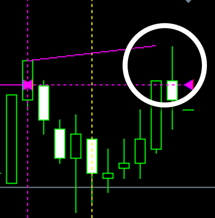
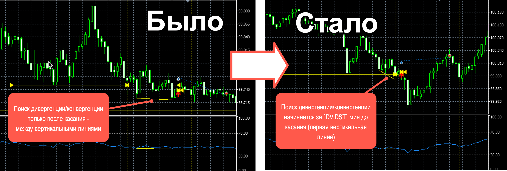

# PADD
Торговая система для MetaTrader 5, которая использует торговлю от уровней, образованных фракталами, после дивергенции с RSI.

* Разработчик: Denis Kislitsyn | denis@kislitsyn.me | [kislitsyn.me](https://kislitsyn.me)
* Версия: 4.01

## Что нового?

#### ==Версия v4.01 от 2025-03-13==
`[+]` Добавлен `F.LEX`: Срок действия уровня, мин

#### ==Версия v4.00 от 2025-03-12==
- `[+]` Добавлен фильтр уровня `LSF.LE.ENB`, если экстремум левого плеча пробивает уровень.
- `[+]` Добавлен фильтр уровня `LSF.SC.MOD`, если экстремум левого плеча ниже экстремума правого.

#### Версия v3.02 от 2025-02-14
- `[+]` 'TTI.HI.ASM' и 'TTI.HI.BSM' для фильтрации касания уровня внутри минуты.
    - ASM=60 и BSM=60 - фильтр отключен, касание в любую секунду минуты валидное.
    - ASM=5 и BSM=60 - касание начиная с 5-ой секунды включительно каждой минуты будет отфильтровано.
    - ASM=5 и BSM=55 - касание начиная с 5-ой включительно и по 55 секунду каждой минуты будет отфильтровано.
    - ASM=0 и BSM=55 - касание начиная с 0-ой включительно и по 55 секунду каждой минуты будет отфильтровано.
    

#### Версия v3.01 от 2025-01-16
- `[+]` 'DV.TCH.*.ATR.*' фильтр глубины отскока от уровня по диапазону ATR.

#### Версия v3.00 от 2024-12-23
- `[*]` 'DV.SAF.E' фильтр дивергенция, которые начинаются на свече фрактала.
- `[*]` 'DV.TCH.*.RSI.*' фильтры по RSI в момент касания уровня.

#### Версия v2.11 от 2024-10-30
- `[*]` Уровень ретеста откладывается от HIGH cвечи ОН для уровня сопротивления и от LOW для поддержки.

#### Версии v2.08-2.10 от 2024-10-15
- `[*]` `DV.LHF.TD.E` теперь проверяет пробитие уровня, начиная со свечи обратного направления (DN+1). Количество свечей задается в `DV.LHF.C`.

- `[*]` Исправлена ошибка проверки пересечения цены, если цены сдвинуты под соседние бары.
- `[*]` Исправлена ошибка поиска левой границы периода див/конвергенции для `DV.DST`.
- `[*]` `DV.NBE.E` теперь определяет экстремум по обеим соседним свечам, включая правую.
    

#### Версии v2.03-2.07 от 2024-10-13
- [x] v2.07: [+] `EN.SL.AR`: Множитель ATR для SL (0-откл). Если установить значение 0.0, то бот применит фиксированный SL, исходя из параметра `EN.SL.FD`. TP бот всегда рассчитывает, применяя коэффициент `EN.TPRR` к итоговому SL.
- [x] v2.06: Сбор статистики по нескольким временам закрытия позиций при тестировании. В параметрах `TS.FCA.M` и `TS.EC.AL.M` теперь можно задать список значений через `;`. В режиме тестирования бот посчитает WinRate по часам для каждого значения из списка за один прогон. Все результаты бот сохранит в CSV-файл.
- [x] v2.05: Поиск дивергенций левее касания уровня за `DV.DST` мин.

- [x] v2.04: Фильтр фракталов `F.F.OEN`, чтобы допустить фракталы только на экстремумах за N баров на таймфрейме `F.FTF`. 
- [x] v2.03: Debug лог для DV.HLB.E.

#### Версия v2.01 от 2024-09-26
- [x] Добавлен режим тестирования по правилам БО. В этом режиме бот входит сделки по правилам Forex, но внутри себя подсчитывает результат всегда по цене Bid в момент открытия позиции и момент ее закрытия. Режим задает настройка `EN.MOD`.
- [x] В режиме тестирования бот может закрыть позиции двумя способами:
    - через фиксированное время;
    - в режиме экспирации.
- [x] Результаты тестирования бот выводит на закладке `Journal` и сохраняет в CSV-файл в каталоге-песочнице тестирования терминала, который можно открыть для анализа в Excel или другом редакторе.
> **ВАЖНО!**
    1. Терминал MetaTrader 5 в режиме тестирования может сохранить файлы *только* в каталоге-песочнице. Она расположена в внутри каталога данных MT5 `~\AppData\Roaming\MetaQuotes\Tester\<ИД_вашего_ДЦ>`.
    2. Внутри этого каталога находятся несколько других каталогов вида `Agent-*-*`. CSV-файл с результатами тестирования сохраняется в одном из этих каталогов. Какой конкретно каталог будет выбран зависит от выбора MT5. Поэтому чтобы найти файл посмотрите все эти каталоги и внутри подкаталог `Files`.
    3. **После запуска новой сессии тестирования MT5 очищает все песочницы. Поэтому скопируйте файл с результатами прошлого теста в другое место перед запуском нового.**

#### Версия v1.10 от 2024-09-08

- [x] 1. Ограничение по минимальной задержке между входами в позиции, чтобы убрать входы в один и тот же момент времени, настраивается параметром `EN.PD`.
- [x] 2. **Обязательно пробитие уровня слева от дивергенции/конвергенции** включается параметром `DV.LHF.TD.E`, а глубина задается в `DV.LHF.C`.
    > **ВАЖНО:** Этот режим взаимно исключает режим **`DV.LHF.LL.E`: Запретить пробитие уровня слева от дивергенции/конвергенции* из прошлых версий. Поэтому одновременно должен быть активирован или `DV.LHF.TD.E` или `DV.LHF.LL.E`. Иначе все сетапы будут невалидные.
- [x] 3. **Запрещены дивергенции, где свечи цены пересекают сегменты линий дивергенции**.
- [x] 4. **Запрещены конвергенции, где свечи цены пересекают сегменты линии конвергенции**.
- [x] 5. Добавлен **фильтр дивергенций/конвергенций по мин. наклону сегментов на ценовом графике.** Для этого применяется мин. расстояние ATR между вершинами дивергенции/конвергенции на графике цены. Задается настройками `ATR.DP.E` `ATR.DP.R`. Если дистанция между соседними вершинами меньше `ATR*ATR.DP.R`, то бот игнорирует дивергенцию/конвергенцию. Значение ATR берется по свече конца сегмента дивергенции/конвергенции. Для многосегментных дивергенций/конвергенций в расчете участвуют ATR свечей концов каждого сегмента.
- [x] 6. **Фильтр по мин. расстоянию в % между соседними вершинами дивергенции/конвергенции на RSI.** Включить фильтр настройкой `RSI.DP.E`. Установить мин. допустимое значение - `RSI.DP.V`.
- [x] 7. Запретить пробитие уровня от касания до конца дивергенции. Требование убрали, заменив на противоположенное в п.12.
- [x] 8. **Потенциальный вход в позицию в момент ограниченный временным фильтром инвалидирует уровень**. Теперь образование новых дивергенций/конвергенций стало невозможным от уровней, которые аннулированы потенциальными входами в запрещенное время.
- [x] 9. **Ретест уровня**. Теперь после образования сетапа бот установит новый уровень, в зависимости от настроек ретеста в группе `5. РЕТЕСТ (RT)`. После его касания бот войдет в позицию.
- [x] 10. **Режим проверки разрешенных диапазонов RSI**: `Все вершины` или `Только последняя` задается параметром `DV.RSI.FM`.
    > **ВАЖНО:**
    Теперь бот строит значительно больше дивергенций/конвергенций. Потому что он находит и те, что находятся вне ограничивающих диапазонов значений RSI. Только после того как нашел все возможные дивергенции/конвергенции, бот отфильтровывает те, что не входят в разрешенные диапазоны в соответствии режимом. Это изменение заметно замедлило работу бота.
- [x] 11. Теперь касание уровня бот определяет без учета спреда - всегда по Bid цене. Стрелку тоже рисует на Bid-цене. 
    > **ВАЖНО:**
    Уровни SL и TP, а также цену входа, по-прежнему определяет брокер в зависимости от направления входа: Ask для покупок и Bid для продаж.
- [x] 12. Фильтр дивергенции по условию, чтобы **последняя свеча обязательна должна быть выше всех, начиная с касания** включается параметром `DV.HLB.E`.

#### 2024-08-05
- [x] Дивергенция и конвергенция отличаются для RES и SUP уровня:
    1. RES: Линии сходятся - конвергенция.
    2. RES: Линии расходятся - дивергенция.
    3. SUP: Линии сходятся - дивергенция.
    4. SUP: Линии расходятся - конвергенция.

#### 2024-07-28
- [x] 1. Исправлена ошибка. Стрелка появляется в конце периода, а не после образования дивера. Сет выше.
- [x] 2. Добавить раздельные настройки для определения дивергенции (сходящаяся) и конвергенции (расходящаяся).
- [x] 3. Добавлена функцию реверса стрелки и позиций.
- [x] 4. Мин. и макс. RSI.
- [x] 5. Поиск дивергенции в диапазоне коэффициент*атр от линии фрактала, и если дивергенция за пределами его, то вход невалиден.
- [x] 6. Добавить вход без дивергенции сразу после пробития уровня.

## Торговая стратегия

1. Бот использует кастомный индикатор поиска фракталов `PADD-Fractal-Ind`.
2. Каждый найденный фрактал образует уровень.
3. Бот ждет возврата цены в уровень, после чего ожидает образования дивергенции с RSI.
4. Если дивергенция образовалась в отведенное время, бот входит в позицию.
5. Входы могут быть отфильтрованы по некоторым условиям из настроек.

## Установка
1. Убедитесь, что ваш терминал MetaTrader 5 обновлен до последней версии. Для тестирования советников рекомендуется обновить терминал до самой последней бета-версии. Для этого запустите обновление из главного меню `Help->Check For Updates->Latest Beta Version`. На прошлых версиях советник может не запускаться, потому что скомпилирован на последней версии терминала. В этом случае вы увидите сообщения на вкладке `Journal` об этом.
2. Установите индикатор `PADD-Fractal-Ind` в ваш терминал. Для этого скопируйте файл индикатотра `*.ex5` в каталог данных терминала `MQL5\Indicators`.
3. Установите советник в ваш терминал. Для этого скопируйте файл бота `*.ex5` в каталог данных терминала `MQL5\Experts\`.
4. Бот использует динамическое обновление фильтра времени торговли из внешнего текстового файла. Для этого он мониторит его изменения, которые сразу принимает к исполнению. Для работы этого функции нужно дать дополнительное разрешения в вашем терминале в главном меню терминала `Tools->Options` на закладке `Expert Advisors` установите флажок `Allow DLL imports`.
4. Откройте график пары.
5. Переместите советника из окна Навигатор на график.
6. Установите в настройках бота на закладке `Common` галочку `Allow Auto Trading` и на закладке `Dependencies` галочку `Allow DLL imports`.
7. Включите режим автоторговли в терминале, нажав кнопку `Algo Trading` на главной панели инструментов.

## Настройки

##### 1.1 ВХОДЫ (EN)
- [x] `EN.MOD`: Режим: `Торговля`, `Тест БО: Фиксированное время, мин`, `Тест БО: Экспирация`.
- [x] `EN.E`: Открывать позиции?
- [x] `EN.MMT`: Тип расчета лота
- [x] `EN.MMV`: Значение для расчета лот
- [x] `EN.SL.FD`: Фиксированная дистанция SL, пункт
- [x] `EN.SL.AR`: Множитель ATR для SL (0-откл)
- [x] `EN.TPRR`: Мультипликатор RR для TP
- [x] `EN.PD`: Мин. задержка между позициями (0-нет), мин

##### 1.2 ТЕСТИРОВАНИЕ (TS)
- [x] `TS.ED.S`: Задержка перед входом в позицию, сек
- [x] `TS.FCA.M`: Фиксированное время в сделке через ";", мин
- [x] `TS.EC.TF`: Таймфрейм определения экспирации
- [x] `TS.EC.AL.M`: Мин.время от стрелки до конца бара экспирации через ";", мин  

##### 2. СТРЕЛКИ (ARR)
- [x] `ARR.E:` Рисовать стрелки?
- [x] `ARR.B.CD`: Код стрелки BUY
- [x] `ARR.B.CL`: Цвет стрелки BUY
- [x] `ARR.B.CD`: Код стрелки SELL
- [x] `ARR.B.CD`: Цвет стрелки SELL

##### 3.0. ФРАКТАЛЫ (F)
- [x] `F.FTF`: Timeframe фракталов
- [x] `F.LEX`: Срок действия уровня, мин
- [x] `F.LEX`: ==Срок действия уровня, мин==
- [x] `F.LSP`: Доп. сдвиг уровня от фрактала, пункт
- [x] `F.F.OEN`: Фильтр: Только на экстремуме за N баров на F.FTF ТФ (0-откл)

##### 3.1. ФРАКТАЛ ВЕРХ (FU)
- [x] `FU.E`: Фрактал включен?
- [x] `FU.LBC`: Свечей слева, шт
- [x] `FU.LHS`: HIGH свечей слева упорядочены
- [x] `FU.LLS`: LOW свечей слева упорядочены
- [x] `FU.RBC`: Свечей справа, шт
- [x] `FU.RHS`: HIGH свечей справа упорядочены
- [x] `FU.RLS`: LOW свечей справа упорядочены
- [x] `FU.ACD`: Код символа стрелки
- [x] `FU.ACL`: Цвет стрелки

##### 3.2. ФРАКТАЛ НИЗ (FD)
- [x] `FD.E`: Фрактал включен?
- [x] `ARR.R`: Реверс стрелок и сделок?
- [x] `FD.LBC`: Свечей слева, шт
- [x] `FD.LHS`: HIGH свечей слева упорядочены
- [x] `FD.LLS`: LOW свечей слева упорядочены
- [x] `FD.RBC`: Свечей справа, шт
- [x] `FD.RHS`: HIGH свечей справа упорядочены
- [x] `FD.RLS`: LOW свечей справа упорядочены
- [x] `FD.ACD`: Код символа стрелки
- [x] `FD.ACL`: Цвет стрелки

##### 4. ДИВЕРГЕНЦИЯ (DV): D1-D2-...-DN
- [x] `DV.DIV.M`: Режим дивергенции
    - [x] `Отключена`: Вход в сделку сразу после пробития уровня
    - [x] `Только дивергенция`: Вход в сделку только после образования *дивергенции*:
        - для уровня RES - линии расходятся;
        - для уровня SUP - линии сходятся.
    - [x] `Только конвергенция`: Вход в сделку только после образования *конвергенции*:
        - для уровня RES - линии сходятся;
        - для уровня SUP - линии расходятся.
    - [x] `Дивергенция и конвергенция`: Вход в сделку после образования дивергенции или конвергенции
- [x] `DV.DBL`: Timeframe дивергенции
- [x] `DV.DST`: Свдиг ожидания дивергенции влево от касания, мин
- [x] `DV.DEX`: Срок ожидания дивергенция, мин
- [x] `DV.BB.MIN`: Мин. количество баров между вершинами RSI, шт
- [x] `DV.BB.MAX`: Макс. количество баров между вершинами RSI, шт
- [x] `DV.RSI.FM`: Режим фильтра вершин RSI: `Все вершины` или `Последняя вершина`
- [x] `DV.SUP.RSI.MIN`: Мин. RSI для вершин поддержки
- [x] `DV.SUP.RSI.MAX`: Макс. RSI для вершин поддержки
- [x] `DV.RES.RSI.MIN`: Мин. RSI для вершин сопротивления
- [x] `DV.RES.RSI.MAX`: Макс. RSI для вершин сопротивления
- [x] `DV.MPC`: Мин. количество последовательных сегментов дивергенции. 1-одинарная, 2-двойная, 3-тройная и т.д. 
    > **ВАЖНО!** Больше 3-х выбирать только после тестирования, потому что рекурсивный алгоритм их поиска замедляется экспоненциально с ростом количества.
- [x] `DV.VA`: Разрешить разнонаправленные сегменты (\\/ или /\\). *Если отключены, то направления последующих сегментов должны совпадать с первым. Иначе сегменты могут быть разнонаправлен, но обязательно противоположены между графиком цены и RSI.*
- [x] `DV.LHF.LL.E`: Запрет пробития уровня слева от D1 на DV.LHF.C
- [x] `DV.LHF.TD.E`: Обязат. пробитие уровня слева от DN+1 на DV.LHF.C
- [x] `DV.LHF.C`: Количество свечей слева для проверки пробития уровня
- [x] `DV.HLB.E`: Последняя свеча дивергенции обязательна должна быть выше всех, начиная с касания. Включенный фильтр проверяет сетап только для дивергенции. Поэтому для конвергенций он не применяется.
- [x] `DV.NBE.E`: Использовать H/L соседней свечи цены для дивергенции. *Если включено, то линия дивергенции на графике определяется максимальным значением свечи пика/впадины RSI и соседней справа*.
- [x] `DV.SAF.E`: Дивергенции обязательно начинается на фрактале
- [x] `DV.TCH.SUP.RSI.MIN`: Мин. RSI в момент касания для поддержки
- [x] `DV.TCH.SUP.RSI.MAX`: Макс. RSI в момент касания для поддержки
- [x] `DV.TCH.SUP.RSI.MIN`: Мин. RSI в момент касания для сопротивления
- [x] `DV.TCH.SUP.RSI.MAX`: Макс. RSI в момент касания для сопротивления
- [x] `DV.TCH.SUP.ATR.MIN`: Мин. ATR в момент касания для поддержки
- [x] `DV.TCH.SUP.ATR.MAX`: Макс. ATR в момент касания для поддержки
- [x] `DV.TCH.RES.ATR.MIN`: Мин. ATR в момент касания для сопротивления
- [x] `DV.TCH.RES.ATR.MAX`: Макс. ATR в момент касания для сопротивления

##### 5. РЕТЕСТ (RT)
- [x] `RT.E`: Ретест включен?
- [x] `RT.IE`: Коэф. ATR размера свечи обратного направления для немедленного входа
- [x] `RT.NE`: Коэф. ATR размера свечи обратного направления для инвалидации уровня
- [x] `RT.BR`: Коэф. размера свечи обратного направления для ретест уровня (0.5=50%)
- [x] `RT.EXP`: Срок ожидания ретеста, мин

##### 5. RSI
- [x] `RSI.MAP`: RSI Период MA
- [x] `RSI.AP`: RSI Применять к цене
- [x] `RSI.DP.E`: Фильтр входа по мин. дистанции между вершинами RSI дивергенции
- [x] `RSI.DP.V`: Мин. дистанция между вершинами RSI дивергенции, %

##### 6. ATR
- [x] `ATR.MAP`: Период MA
- [x] `ATR.BR.E`: Фильтр входа по H-L свечи обратного направления
- [x] `ATR.BR.R`: Мультипликатор ATR для свечи обратного направления
- [x] `ATR.LD.E`: Фильтр входа по дистанции от уровня до H/L старта дивергенции
- [x] `ATR.LD.R`: Мультипликатор ATR для дистанции от уровня до H/L старта дивергенции
- [x] `ATR.DP.E`: Фильтр входа по мин. дистанции между вершинами ценовой дивергенции
- [x] `ATR.DP.R`: Мультипликатор ATR для дистанции между вершинами ценовой дивергенции

##### 7. ФИЛЬТР
- [x] `TTI.E`: Фильтр времени включен? 
- [x] `TTI.FN`: Полное имя INI файла настроек фильтра по времени
- [x] `TTI.HI.ASM`: Отфильтровать касания после какой секунды каждой минуты (>=60-откл)
- [x] `TTI.HI.BSM`: Отфильтровать касания до какой секунты каждой минуты  (>=60-откл)
- [x] `LSF.LS.RAT`: ==Коэф. длины левого плеча к длине правого (0-откл)==
- [x] `LSF.LE.ENB`: ==Запретить пробой H/L левого плеча==
- [x] `LSF.SC.MOD`: ==Фильтр по экстремумам левого и правого плечей==

##### 8. ДОПОЛНИТЕЛЬНЫЕ НАСТРОЙКИ
- [x] `Magic`: Идентификатор эксперта
- [x] `GP`: Префикс комментариев и графики
- [x] `MS.CE`: Comment Enable (turn off with no visual for speed)
- [x] `MS.CI`: Comment Interval update, sec
- [x] `MS.LL`: Log Level

[def]: img